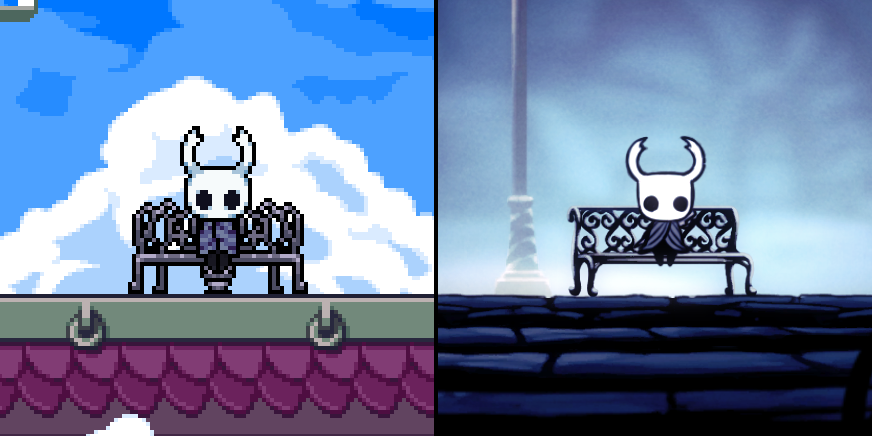

**The Knight** is a playable character mod for [_Rivals of Aether_](https://rivalsofaether.com/), adding the Knight from [_Hollow Knight_](https://www.hollowknight.com/) in the game.

This project was developed as part of the [ZPMods](https://twitter.com/zpmods?lang=fr) team.

This was our first _Rivals of Aether_ mod, as well as the first mod we ever developed together.

_Screenshots of the character being used in-game._

## Links

- <i class="fa-brands fa-steam"></i> - Downloadable on [Steam Workshop](https://steamcommunity.com/sharedfiles/filedetails/?id=2105527362).
- <i class="fa-brands fa-github"></i> - Source code on [Github](https://github.com/ZPMods/roa-the-knight).

## Gameplay

The goal with the mod was to **bring the character** from _Hollow Knight_ directly into _Rivals of Aether_.

Thus, we took **heavy inspiration** from the original game for our moveset. A lot of the attacks, if not all, are a **direct reference** to something in _Hollow Knight_.

For example:
- The forward, up and down aerial attacks are directly taken from the **directional attacks** of the original game.

_Aerial attacks in Rivals of Aether._

_Directional attacks in Hollow Knight._

- The special attacks are all inspired by **spells and upgrades** from the original game.

_Special attacks in Rivals of Aether._

_Spells and upgrades in Hollow Knight._

- The taunt is inspired by the **checkpoints** from the original game.

_To the left, the taunt in Rivals of Aether. To the right, the checkpoint in Hollow Knight_

## Videos

### Release trailer



### How to play



## Team

- [**Fabien Calendrier**](https://fabiencalendrier.fr/) - Game Design, Additional Programming
- [**Danilo Ferme**](https://lamenor.artstation.com/) - Programming
- **Orso Philipponnat** - Pixel Art, Animation, Programming