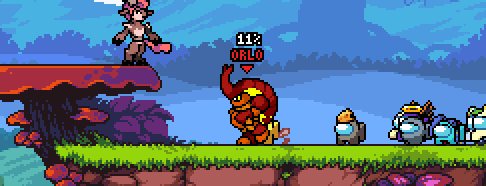

**Crewmate Army** is a buddy mod for [_Rivals of Aether_](https://rivalsofaether.com/), adding a group of crewmates, from [_Among Us_](https://www.innersloth.com/games/among-us/), following you around. They react to various events in-game, including kills, the player taking damage, or taunts.

_Gif of the mod being used in-game._

## Links

- <i class="fa-brands fa-steam"></i> - Downloadable on [Steam Workshop](https://steamcommunity.com/sharedfiles/filedetails/?id=2789013911).
- <i class="fa-brands fa-github"></i> - Source code on [Github](https://github.com/ZPMods/roa-amogus-army).

## Behavior

While _Rivals of Aether_ does have a built-in [buddy system](https://rivalsofaether.com/patch-1-4-7-the-buddy-system/), it is not made to handle mutiple buddies at once.

Instead, I developed a new AI from scratch, designed to work with a bunch of buddies at once, without making them feel repetitive.

Some aspects of this AI include:
- Crewmates following the player around at their own pace, and taking regular pauses.
- Crewmates being able to jump up and down platform.
- Crewmates sometimes getting distracted, in which case they will stop following the player for a while, and either walk around or sit down.
- Crewmates doing a random taunt out of a pool instead of always the same one.
- Crewmates being able to take damage and being able to die.
- New crewmates spawning everytime the player gets a kill.

<video width="100%" controls="controls">
  <source src="/assets/img/posts/portfolio/crewmate-army/crewmates_showcase.mp4" type="video/mp4">
</video>

## Team

- **Orso Philipponnat** - Pixel Art, Animation, Programming
- **Abigaëlle Batt** - Additional Pixel Art