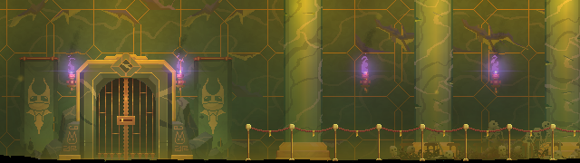
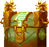
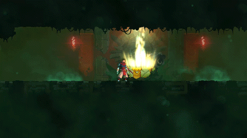
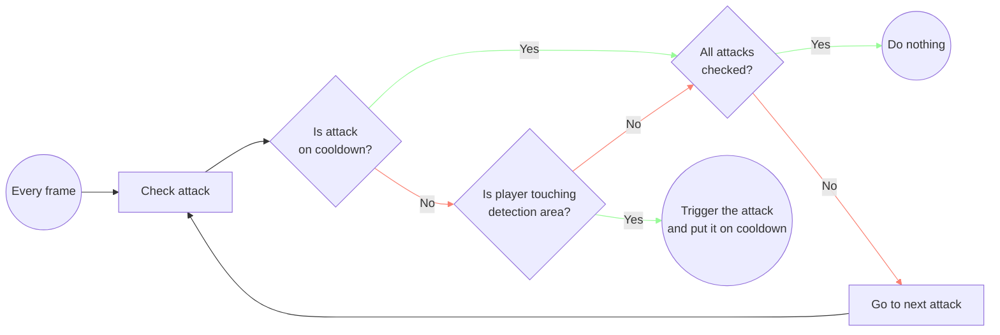
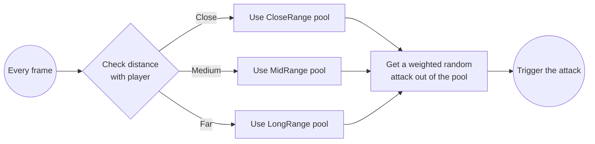

## Introduction

Update 2.8, officially named **Break the Bank**, was focused on adding new mechanics and features around gold (the game's in-run currency), with a new free biome, as well as a bunch of enemies and weapons.

### Notable additions and changes

- **NEW** - [The Bank](https://deadcells.wiki.gg/wiki/The_Bank)
  - A new biome that can appear at any point in the run, that can replace any other level, with the goal of providing a harder but more rewarding challenge.
- **NEW** - [Gold Digger](https://deadcells.wiki.gg/wiki/Gold_Digger), [Dagger of Profit](https://deadcells.wiki.gg/wiki/Dagger_of_Profit) and [Money Shooter](https://deadcells.wiki.gg/wiki/Money_Shooter)
  - Three weapons that all interact with gold.
- **NEW** - [Midas' Blood](https://deadcells.wiki.gg/wiki/Midas%27_Blood), [Gold Plating](https://deadcells.wiki.gg/wiki/Gold_Plating) and [Get Rich Quick](https://deadcells.wiki.gg/wiki/Get_Rich_Quick).
  - Three [mutations](https://deadcells.wiki.gg/wiki/Mutations) that all interact with gold.
- **NEW** - [Agitated Pickpocket](https://deadcells.wiki.gg/wiki/Agitated_Pickpocket), [Gold Gorger](https://deadcells.wiki.gg/wiki/Gold_Gorger) and [Golden Kamikaze](https://deadcells.wiki.gg/wiki/Golden_Kamikaze).
  - Three enemies that all appear in the Bank.
- **NEW** - [Mimic](https://deadcells.wiki.gg/wiki/Mimic)
  - A mini-boss that can appear in the Bank, randomly replacing one of the [shops](https://deadcells.wiki.gg/wiki/Shops) and attacking the player if they try buying anything.

_Screenshot of the entrance to the Bank._

> A full list of changes can be found on the [Dead Cells Wiki](https://deadcells.wiki.gg/wiki/Version_2.8).
{: .prompt-info }

## What I worked on

### The weapons

The three weapons added in the update all have mechanics centered around gold:
- **Gold Digger**
  - A melee weapon resembling a pickaxe. Enemies hit with the weapon drop gold, and having enough gold makes it deal critical hits.
- **Dagger of Profit**
  - A dagger that deals critical hits for a few seconds after the player picks up any kind of gold.
- **Money Shooter**
  - A ranged weapon, firing projectiles in the form of nuggets, removing some gold from the player's inventory each time.

_Gif of a player using the Money Shooter, then the Gold Digger._

In _Dead Cells_, the player can carry two weapons and three [mutations](https://deadcells.wiki.gg/wiki/Mutations) at a time. The goal was for those to synergize not only with each other, but also with the mutations. Having some mechanics that give, take away or react to gold lets the player combine them and play around with them.

I was tasked with implementing all three of the weapons above. Their overall mechanics were already designed, but I had creative liberty for their implementation and for some specific values (such as the amount of gold used by the Money shooter, or the duration of the Dagger of Profit buff.)

### The Bank spawning mechanic

{: .right}

The Bank is a special level, in the sense that it can be found randomly at any point throughout the run. In _Dead Cells_, each biome has [multiple exit doors leading to a transition to another biome](https://deadcells.wiki.gg/wiki/Biomes_map). The Bank entrance takes the form of a chest that can randomly appear in any transition, as an optional alternate path. 

The chance of the Bank entrance appearing increases with each level visited, making it less and less rare as the player progresses through the run.

If the player interacts with the chest, it will open and they will jump in it, leading them to the Bank.

{: width="500"}
_Gif of a player jumping in the Bank entrance chest._

### The Bank level structure

While I didn't end up making the level design of the rooms for the Bank, I did implement the overall structure of it.

The biome is centered on an elevator, leading to four different floors:
- Three main floors, locked behind colored key doors (red, blue and green), that have to be explored one after the other.
- One secondary floor, locked behind a gold door (a locked door that can be opened by paying some gold), that can be accessed at any point.

In the beginning of the level, the player can find a [Red Pass](https://deadcells.wiki.gg/wiki/Pickups#Red_Pass), granting access to the red floor. The red floor then contains the [Blue Pass](https://deadcells.wiki.gg/wiki/Pickups#Blue_Pass), and the blue floor contains the [Green Pass](https://deadcells.wiki.gg/wiki/Pickups#Green_Pass).

The red and blue floors are both mandatory to complete, as the exit can be found somewhere in the blue floor, while the green one is completely optional and hosts a special platforming challenge, granting good rewards if completed.

_Sketch of the Bank's overall structure._

### The Mimic

The [Mimic](https://deadcells.wiki.gg/wiki/Mimic) is a special mini-boss that can appear in the Bank. When the player enters the level, one of the [shops](https://deadcells.wiki.gg/wiki/Shops) gets chosen randomly and is replaced with a Mimic.

A replaced shop looks completely normal, and is impossible to spot. If the player tries buying anything from the shop, the Mimic will spawn, eat the item that the player tried to buy, and start attacking them.

_The Mimic._

The Mimic is the enemy with the most complex moveset in the game (besides bosses), and uses a more complex system than usual.

Enemies have a list of attacks, each with a cooldown value and detection area. They then iterate over that list of moves and execute them as follow:

The Mimic doesn't use this system. Instead, it has three different pools of attacks depending on his position in relation with the player: `CloseRange`, `MidRange` and `LongRange`. Those pools are then filled with his 4 basic attacks:

<b>Bite</b>

  

  
  _A fast bite with short range._
  

<b>Tongue Lash</b>

  

  
  _A medium range tongue lash, stunning the player for a short time if it hits._
  

<b>Chain Whip</b>

  

  
  _A long range whip attack using chains._
  

<b>Hook Throw</b>

  

  
  _Charges a hook and throws it at the player. If it hits, they get grabbed and pulled toward the Mimic._
  

 

Additionally, the Mimic gains one more move, depending on the kind of item it ate upon spawning. This move is added to the corresponding pool.

If it ate a melee weapon: <b>Sword Slash</b>

  

  
  _A slow but big melee attack._
  

If it ate a ranged weapon: <b>Spit</b>

  

  
  _Spits out 2 bursts of 5 projectiles in a fan._
  

If it ate a shield: <b>Parry</b>

  

  
  _Turns into a shield. If the player hits it in this state, they get stunned, and the Mimic will counter-attack._
  

If it ate a skill: <b>Spikes</b>

  

  
  _Charge a huge area-of-effect attack, hitting all around it._
  

If it ate a healing item: <b>Feeding</b>

  

  
  _Stops and starts eating a body part for health. The player can interrupt it with an attack._
  

 

Moves added to pool are also given a `weight` that defines how likely each of them is to be triggered.

> For example, while both **Bite** and **Tongue Lash** are added to the `CloseRange` pool, **Bite** get assigned a bigger weight, as its speed and range make it more pertinent to use at close range.
{: .prompt-info }

 
With all the pools filled, this is how the Mimic executes its moves:

