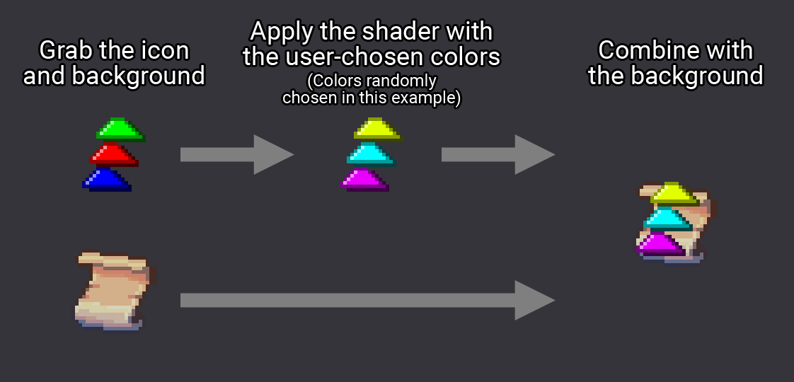

## Introduction

Update 2.9, officially named **Breaking Barriers**, was focused on adding many accessibility options to the game, from visual aids to a full assist mode.

### Notable additions and changes

- **NEW** - [Assist Mode](https://deadcells.wiki.gg/wiki/Assist_Mode_and_Accessibility#Assist_Mode)
  - Available in the options menu, lets the player adjust the difficulty of the game by tweaking settings.
- **NEW** - [Bunch of visual accessibility options](https://deadcells.wiki.gg/wiki/Assist_Mode_and_Accessibility#Accessibility_Settings)
  - A lot of options letting the player change some visual aspects of the game to help readability.
- **NEW** - [Bunch of gameplay and customization options](https://deadcells.wiki.gg/wiki/Assist_Mode_and_Accessibility#Additional_Settings)
  - More accessibility options, but centered around things like gameplay, sound, or icons.

_Screenshot of the game with the "customizable outlines" option on._

> A full list of changes can be found on the [Dead Cells Wiki](https://deadcells.wiki.gg/wiki/Version_2.9).
{: .prompt-info }

## What I worked on

I was the main programmer on this update, and I am very proud of the accessibility options we were able to bring to the game.

Before starting the development of the update, we [opened a conversation with the _Dead Cells_ community](https://twitter.com/motiontwin/status/1483059164901433345), and gathered as much feedback as we could, allowing us to get an extensive list of potential features, that we sorted by relevance and difficulty of implementation. 

We had two major guidelines that we followed closely during development: **add as many features as we could** and make them **as customizable as possible**. If a feature could help at least one person, then it was worth looking into.

As development continued, we reached out to [AbleGamers](https://ablegamers.org/) and organized a test panel with them. They gave us very valuable feedback that we applied thoroughly, and it helped us correct some things that we missed.

### Input options

In terms of input, we had a few goals in mind:
- Allow the game to be played with any controller.
- Remove any need for held or consecutive inputs.

The first step was to rework all non-rebindable actions in the game, as well as all that needed a combination of inputs, and give them alternatives. Here's the list of all the actions that were changed this way:

| Action                | Original input                    | Added alternatives                                                              |
| --------------------- | --------------------------------- | ------------------------------------------------------------------------------- |
| Secondary Interaction | Long press on the Interact button | - Custom bind                                                                   |
| Dive Attack           | Hold down + Press Jump button     | - Hold down while airborne - Double tap down while airborne - Custom bind |

Additionally, both controller sticks and the D-Pad had one function and one function only, and were not rebindable. This was changed:

| Input       | Original Function    | Added alternatives                                   |
| ----------- | -------------------- | ---------------------------------------------------- |
| Left stick  | Moving the character | - Camera movement - Treat as rebindable inputs    |
| Right stick | Moving the camera    | - Character Movement - Treat as rebindable inputs |
| D-Pad       | Rebindable inputs    | - Character movement - Camera movement            |

Opening such input customization is the key to making the game work with any kind of controller.

There were still some problems with other actions, that were solved not through rebindable inputs, but by adding ways to bypass them entirely:

| Action               | Problematic input                                                                 | Implemented solution                                                               |
| -------------------- | --------------------------------------------------------------------------------- | ---------------------------------------------------------------------------------- |
| Double jump          | Requires the player to press the Jump button twice                                | "Hold to jump" option. The character will jump as long as the Jump button is held  |
| Chaining rolls       | The player is sometimes required to press the Roll button multiple times in a row | "Hold to roll" option. The character will roll as long as the Roll button is held  |
| Holding a shield out | Requires the player to hold down the Shield button                                | "Toggle shield" option. The shield will stay out until the button is pressed again |

_Note: unfortunately, some of these options do still require the player to hold down a button, as completely removing that scenario proved to be tricky. We settled on this middle ground, where the important part was to offer an alternative to the players who might need it._

### Customizable stats colors

_Dead Cells_ has 3 differents [stats](https://deadcells.wiki.gg/wiki/Stats) that the player can invest into: **Brutality**, **Tactics** and **Survival**. Those stats are present all throughout the game, and interact with of a lot of elements: the player's health scales with their stats, weapons all have assigned stats that their damage will scale on, etc.

The stats can be increased throughout a run by finding [scrolls](https://deadcells.wiki.gg/wiki/Pickups#Scrolls).

_Menu where the player can choose which stat to increase, upon picking up a scroll._

Each stat is represented by an icon and a color. Brutality is red, Tactics is purple and Survival is green.

Even though each stat has an icon associated with it, sometimes only the color is used, and thus, to ensure maximum readability for everyone, we added an option to freely change their colors.

We had to add a new option widget that lets the player choose a color. Option widgets are elements that the player can interact with to change a value. They exist in multiple forms: checkbox, radio buttons, list, or even slider. The color widget is new to this update and was used in every place where the player needs to personalize a color.

_Different kinds of option widgets._

{: width="600"}
_Gif of interacting with the color widget._ 

We then just had to take the color chosen by the player in the options, and apply it everywhere relevant. This worked out of the box for some elements, which were already built to be easily recolored, but most icons had to be reworked in order for them to work.

We needed a way to easily recolor only certain parts of icons. By using a singular color channel (Red, Green or Blue) per stat, we could then use a custom shader to assign the user-chosen colors to the right stat.

The first step in making this work was to change all the icons as follows:

_Example of the icon edit process, using the "All Stats Up Scroll" icon._

Then, when we need to use the icon in-game, we can grab it and its background, color it correctly using the shader, and display that.

_Example of shader being applied to an icon._

We apply this process to every icon that needs it. Some other elements might not have a background, so we just apply the shader accordingly. 

_Comparison between options off and on._

### Synergy icons

In Dead Cells, weapons can apply a variety of [status effects](https://deadcells.wiki.gg/wiki/Status_effects), and sometimes even react to them, with effects such as ["Inflicts a critical hit if the target is bleeding or poisoned"](https://deadcells.wiki.gg/wiki/Sadist%27s_Stiletto).

Weapons can also receive [affixes](https://deadcells.wiki.gg/wiki/Affixes), special attributes that make them more powerful or give them additional abilities. Similarly, those affixes can apply or react to special effects.

This means that weapons and affixes can very often synergize with each other **via their status effects**. However, this was difficult to use effectively, as, the more affixes the weapons have, the more difficult it is to read the effects and understand their synergies.

To remedy that problem and make it easier to understand, we added a system displaying icons next to the effect descriptions, representing what statuses they interact with. The icon also glows if there is a synergy happening in the player's current build.

_Comparison of a mid-game inventory, without and with the synergy icons enabled._

The game uses an extensive database to store data for a number of its objects, including all weapons and affixes. In this database, we added a `synergy` entry for weapons and affixes. When adding `synergy` data, we specify what status effect it interacts with, and if it's a `trigger` (an effect like "Burns nearby enemies") or a `reaction` (an effect like "+40% damage to a burning target").

Then, in-game, we use that `synergy` data to display the icons next to the effect descriptions. If we find both a `trigger` and `reaction` of the status effect in the player's inventory, we use the glowing version of the icon.

All the icons were made by me, you can get a proper look at them below.

_All of the synergy icons, in order: bleed, poison, root, fire, oil, burning oil, ice, slow, shock and stun._

### Other contributions

- Options to customize HUD tranparency and size.
- HUD feedback for when a weapon will display critical strike.
- System to limit the number of particles on screen, by only spawning a certain percentage of them. Can be tweaked in the options.
- Options to change the text size of item names, item descriptions and dialogueS.
- Option to increase the size of attack announces
- Option to add a [colored filter to the background](https://deadcells.wiki.gg/wiki/Assist_Mode_and_Accessibility#Background_filter), with fully customizable color and opacity.
- Added the [Adys](https://adysfont.com/en/) font to the font selection option.
- Reworked the system that displays the head behind the body of the character during certain animations.
- Reorganized the entirety of the options menu, to accomodate for all the new options and the addition of an "Accessibility" tab.

## Public reception

Apart from DLCs, this was one of the rare instances of a free update escaping "containment" and reaching a public outside of the _Dead Cells_ community.

Articles praising the update can be found on [Eurogamer](https://www.eurogamer.net/dead-cells-big-accessibility-focused-breaking-barriers-update-out-now), [Polygon](https://www.polygon.com/23180668/dead-cells-difficulties-accessibility-options-motion-twin), [PC Gamer](https://www.pcgamer.com/dead-cells-is-getting-accessibility-features-including-an-assist-mode/) or even [Nintendo Life](https://www.nintendolife.com/news/2022/06/dead-cells-accessibility-focused-update-adds-assist-mode-difficulty-options-and-more). It was also covered by [Steve Saylor](https://en.wikipedia.org/wiki/Steve_Saylor), a game critic and Accessibility Advocate.



## Official videos

#### Dev Thoughts

