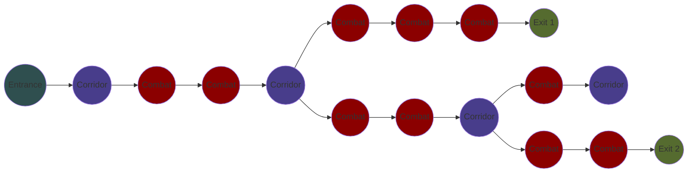
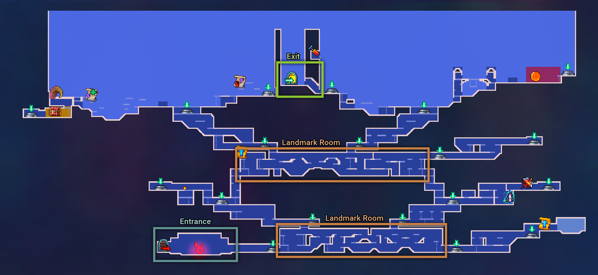

## Introduction

**Return to Castlevania** DLC, also known as update 3.3, is the fourth and biggest paid expansion for _Dead Cells_.

It is an official crossover with [Konami](https://www.konami.com/en/) and the [Caslevania](https://en.wikipedia.org/wiki/Castlevania) franchise, which was made possible thanks to a [collaboration between them and Evil Empire](https://www.ign.com/articles/castlevania-dead-cells-interview-konami).

### Notable additions and changes

- **NEW** - Two new  biomes.
  - [Castle's Outskirts](https://deadcells.wiki.gg/wiki/Castle%27s_Outskirts), a mainly vertical biome where the player must climb an elevator shaft to access the castle.
  - [Dracula's Castle](https://deadcells.wiki.gg/wiki/Dracula%27s_Castle), a biome with the unique characterstic of being capable of looping on itself, as well as being accessible at two different points in a run.
- **NEW** - Three new bosses.
  - [Death](https://deadcells.wiki.gg/wiki/Death), an alternative first boss that is accessible after entering Dracula's Castle at the beginning of a run.
  - [Dracula](https://deadcells.wiki.gg/wiki/Dracula), an alternative final boss that is accessible after entering Dracula's Castle at the end of a run.
  - [Dracula - Final Form](https://deadcells.wiki.gg/wiki/Dracula_-_Final_Form), appears as a second boss after defeating Dracula, the player has to fight him on the falling debris of the destroyed castle.
- **NEW** - New weapons and skills.
  - 6 Melee weapons.
  - 3 Ranged weapons.
  - 1 Shield.
  - 4 Skills.
- **NEW** - New enemies.
  - 4 Melee mobs.
  - 3 Ranged mobs.
  - 2 Flying mobs.
  - 1 Mini-boss.
  - 1 Trap.
- **NEW** - 20 outfits inspired by iconic Castlevania characters.
- **NEW** - [Castlevania alternative soundtrack.](https://deadcells.wiki.gg/wiki/Soundtracks#Dead_Cells:_Return_to_Castlevania_Soundtrack)
  - Replaces all the music in the game with Caslevania tracks.
- **NEW** - [Richter Mode](https://deadcells.wiki.gg/wiki/Richter_Mode).
  - An alternate game mode unlocked after completing the DLC's storyline, where the player gets to control [Richter](https://deadcells.wiki.gg/wiki/Richter) through a Castlevania-inspired map, unlocking upgrades and making their way to [Medusa](https://deadcells.wiki.gg/wiki/Medusa).



> A full list of changes can be found on the [Dead Cells Wiki](https://deadcells.wiki.gg/wiki/Version_3.3).
{: .prompt-info }

## What I worked on

### Dracula's Castle

At the time, the _Dead Cells_ dev team was composed of four artists and four programmers. The main features were the two biomes and three bosses, and they were split between four duos of one programmer and one artist.

Alongside one of the artists, we took care of the entirety of Dracula's Castle. While their role was to create everything artistic related to the biome (concept arts, key arts, in-game assets...), I took care of:
- Designing and implementing the level structure.
- Creating all the rooms in Tiled.
- Implementing the artist's assets according to their intentions.
- Designing and implementing the unique mechanics of the biome.
- Anything else technical related to the biome.

#### Unique mechanics

Dracula's Castle is unique in two ways.

Firstly, it's the only biome in the game that can appear at two different points in the run. At first, it can only appear at the beginning of a run, right before the first boss, in which case it will lead to Death.

Once Death is defeated, it will start appearing as a replacement to the last biome, before the last boss. In that case, the level will be bigger, introduce a mandatory mini-boss, and the exit door will lead to Dracula. 

_To the left, the map of early game Dracula's Castle. To the right, the map of late game Dracula's Castle._

Secondly, it's the only biome in the game that can loop on itself, due to its unique level structure.

#### Level structure

The level structure of a biome is the first step of its procedural generation. It can be represented by a tree of nodes connected to each other.

Each node can have one parent and multiple children, as well as a `type`. 

When generating a biome, the node tree will be generated based on the rules defined in code. 

Example of a node tree:

> "Combat" are rooms where enemies can spawn, "Corridor" are rooms with no enemies.
{: .prompt-info }

Then, each node will be replaced by a room.

The room used is randomly chosen base on the `type` of the node, as well as the number of children of the node. Every room in the game has a certain number of entrances and exits, defined in Tiled, that will determine how they get connected to each other.

Example generation from the node tree above, using rooms from [Prisoners' Quarters](https://deadcells.wiki.gg/wiki/Prisoners%27_Quarters):

While this system works really well for all biomes in the game, it has one major flaw, which is that **node trees can only go forward**.

A node tree cannot go backwards, and each node can only have one parent. This means all the branches of a level are linear, and two branches cannot connect to each other.

For Dracula's Castle, there were three major intentions:
- Make it feel like you are climbing the castle.
- Have at least one big landmark room in the center of the biome, that acts as a HUB for all the branches.
- Give it a "labyrinth" feel.

After playing around with them, I pitched the following idea to the team.

While everyone was on board with the idea, it was going to be a technical challenge, due to the fact that the level structure **loops on itself**, at the second landmark room.

In order to achieve that, the best solution was to fake it. For most biomes, their rooms have vastly different sizes and entrances/exits placement, and as such the same node tree will produce almost chaotic levels that look significantly different to each other.

However, if we were to generalize the size of the rooms, as well as the position of their entrances and exits, we can achieve way more stable results.

In this case, if all the rooms of the same type have the same height and the entrances/exits are at the same height, we can **guarantee** that all the branches will grow vertically at the same rate.

_Some Corridor rooms used in Dracula's Castle, all with the same height._

_Some Combat rooms used in Dracula's Castle, all with the same height._

With this in mind, we can build a node tree that lets us get to a level structure similar to this:

Then, we can fill up the space between the "Landmark Room Start" and "Landmark Room End", using an algorithm that places rooms without using the node tree.

_The beginning and end of the second landmark room, and the additional rooms that connect them together._

And with that, we get a level structure that loops on itself.

_Screenshot of the map of Dracula's Castle in-game, with the Entrance, Landmark rooms and Exit highlighted._

## Official videos

#### Game Awards Animated Trailer



#### Teaser



#### Launch Date Trailer



#### Richter Mode Reveal

